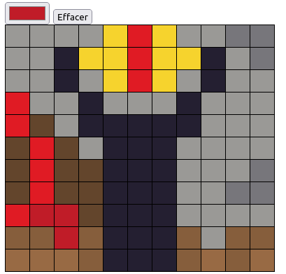

# Pixel Art

The purpose of this dojo is to create a canvas on which the user can express his talents as a pixel artist.
A __style.css__ file is available and contains all the classes necessary for the realization. It is only necessary to write __javascript__.

## Step 1
Add a color picker using input type color. 

## Step 2
Write the script that will generate an HTML table underneath the color picker and whose number of rows and columns will be determined by the `canvasSize` variable.

## Step 3
When you select a color from the color picker, you can draw pixel by pixel in the canvas with the selected color. 
HINT : Use one event listeners per table cell (event click)

## Step 4
Add a reset input. When you click on the button, it cleans the canvas.

